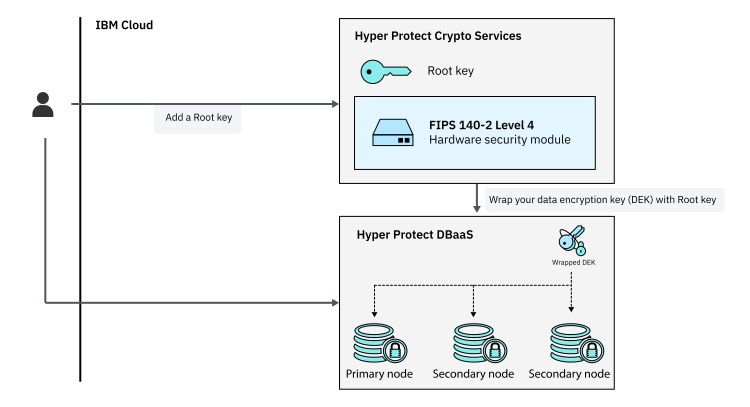

---

copyright:
  years: 2019, 2020
lastupdated: "2020-01-09"

keywords: hyper protect crypto integration, data encryption, byok, kyok

subcollection: hyper-protect-dbaas-for-postgresql

---

{:shortdesc: .shortdesc}
{:codeblock: .codeblock}
{:important: .important}
{:screen: .screen}
{:codeblock: .codeblock}
{:tip: .tip}
{:pre: .pre}
{:note: .note}
{:external: target="_blank" .external}

# {{site.data.keyword.hscrypto}} integration
{: #hpcs-byok}

The data that you store in {{site.data.keyword.cloud}} {{site.data.keyword.ihsdbaas_postgresql_full}} databases is encrypted by default by randomly generated keys. If you need full control over your encryption keys, you can use [{{site.data.keyword.cloud_notm}} {{site.data.keyword.hscrypto}}](/docs/hs-crypto?topic=hs-crypto-overview) to create, add, and manage encryption keys and associate the keys with your {{site.data.keyword.ihsdbaas_postgresql_full}} service instance to encrypt your databases.
{: shortdesc}

The following diagram shows how {{site.data.keyword.ihsdbaas_postgresql_full}} integrates with {{site.data.keyword.hscrypto}}.

{: caption="Integration with {{site.data.keyword.hscrypto}}" caption-side="bottom"}

## Step 1: Creating or adding a root key in {{site.data.keyword.hscrypto}}
{: #hpcs-create-add-key}

To create or add a root key in {{site.data.keyword.hscrypto}}, complete the following steps:

 1. [Provision](/docs/hs-crypto?topic=hs-crypto-provision) and [initialize your {{site.data.keyword.hscrypto}} service instance](/docs/hs-crypto?topic=hs-crypto-initialize-hsm) if you haven't.

2. Navigate to your instance of {{site.data.keyword.hscrypto}} and [create a root key](/docs/hs-crypto?topic=hs-crypto-create-root-keys) or [import an existing root key](/docs/hs-crypto?topic=hs-crypto-import-root-keys).

## Step 2: Granting service authorization
{: #hpcs-grant-authorization}

Authorize {{site.data.keyword.hscrypto}} for use with {{site.data.keyword.ihsdbaas_postgresql_full}} service instances:

1. Open your {{site.data.keyword.cloud_notm}} dashboard.
2. From the menu bar, click **Manage** > **Access (IAM)**.
3. In the side navigation, click **Authorizations**.
4. Click **Create**.
5. In the **Source service** menu, select **{{site.data.keyword.ihsdbaas_postgresql_full}}**.
6. In the **Source service instance** menu, select **All service instances**.
7. In the **Target service** menu, select **{{site.data.keyword.hscrypto}}**.
8. In the **Target service instance** menu, select the service instance to authorize.
9. Enable the **Reader** role.
10. Click **Authorize**.

If you want to remove an authorization, see [Removing an authorization](/docs/iam?topic=iam-serviceauth#remove-auth).

## Step 3: Creating a {{site.data.keyword.ihsdbaas_postgresql_full}} instance with the {{site.data.keyword.hscrypto}} Key
{: #use-hpcs}

When you [create a {{site.data.keyword.ihsdbaas_postgresql_full}} service instance](/docs/hyper-protect-dbaas-for-postgresql?topic=hyper-protect-dbaas-for-postgresql-gettingstarted#creating-a-database-cluster-introduction), select your {{site.data.keyword.hscrypto}} instance and root key.

The new {{site.data.keyword.ihsdbaas_postgresql_full}} service instance uses your {{site.data.keyword.hscrypto}} root key to encrypt your data. To check and manage your root key, click the {{site.data.keyword.hscrypto}} service instance on the **Overview** page in your {{site.data.keyword.ihsdbaas_postgresql_full}} service dashboard. You can also see the key status on the [**Nodes** page](/docs/hyper-protect-dbaas-for-postgresql?topic=hyper-protect-dbaas-for-postgresql-dbaas-webui-nodes#webui-check-node-status).

You can select the {{site.data.keyword.hscrypto}} key only when you create the DBaaS instance. Otherwise, a randomly generated key will be used by default.
{: note}

## Step 4 (Optional): Removing keys and deleting your data
{: #hpcs-remove-key}

If you delete the key that is used to encrypt your service, you lose access to the data. You can't recover the data from the instance. You might be able to recover your data by restoring a backup into a new service instance.
{: important}

If you want to securely delete your data, you must delete both the service instance and the {{site.data.keyword.hscrypto}} key.
