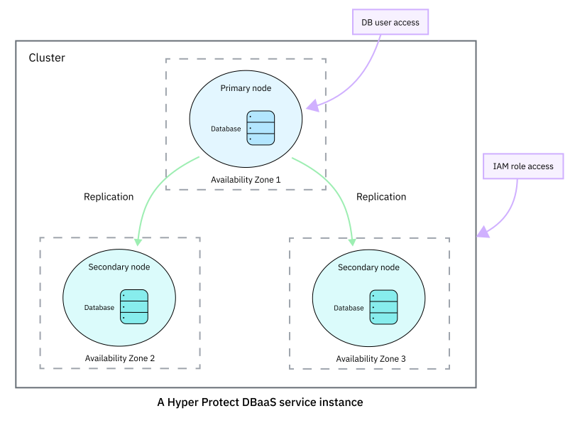

---

copyright:
  years: 2019
lastupdated: "2019-12-20"

keywords: Hyper Protect DBaaS, postgresql database, data security, cloud database

subcollection: hyper-protect-dbaas-for-postgresql

---

{:shortdesc: .shortdesc}
{:codeblock: .codeblock}
{:important: .important}
{:screen: .screen}
{:codeblock: .codeblock}
{:tip: .tip}
{:pre: .pre}
{:note: .note}
{:external: target="_blank" .external}

# Getting started with {{site.data.keyword.cloud_notm}} {{site.data.keyword.ihsdbaas_postgresql_full}}
{: #gettingstarted}

{{site.data.keyword.cloud}} {{site.data.keyword.ihsdbaas_postgresql_full}} is an {{site.data.keyword.cloud_notm}} service that provides {{site.data.keyword.postgresql}} databases on demand. It offers a flexible and scalable platform that allows you to quickly and easily provision and manage your database of choice.
{: shortdesc}

This {{site.data.keyword.cloud_notm}} offering provides {{site.data.keyword.postgresql}} database clusters. Each database cluster has one primary node and two secondary nodes (replicas that back up the primary).

With {{site.data.keyword.cloud_notm}} {{site.data.keyword.ihsdbaas_postgresql_full}}, you can create database clusters in the {{site.data.keyword.cloud_notm}}, view information about your nodes, databases, and users, monitor databases, and view service logs.

## Supported version
{: #postgresql_supported_version}

{{site.data.keyword.ihsdbaas_postgresql_full}} currently supports {{site.data.keyword.postgresql}} 10. It provides a secure, up-to-date version of the {{site.data.keyword.postgresql}} Enterprise database. We upgrade database maintenance versions `major.minor.maintenance` when appropriate.

For more information about versions, see [{{site.data.keyword.postgresql}} support policy](https://www.postgresql.com/support-policy){: external}.

## Prerequisite
{: #prerequisite}

Before you start, make sure you are using the [required browser software](/docs/overview?topic=overview-prereqs-platform) for {{site.data.keyword.cloud_notm}}.

For Safari, ensure that the **Prevent cross-site tracking** and **Block all cookies** options under **Safari > Preferences > Privacy** are not selected.

If you encounter problems using one of the required browsers, disable your browser plug-ins.

## Step 1: Creating a service instance
{: #creating-a-database-cluster-introduction}

When you create a service instance, you create a database cluster (replica set) with one primary and two secondary nodes as replicas, as shown in the following diagram.

{: caption="Figure 1. A {{site.data.keyword.ihsdbaas_full}} service instance" caption-side="bottom"}

If you haven't created a service instance yet, you can create one through [the web user interface](/docs/services/hyper-protect-dbaas-for-postgresql?topic=hyper-protect-dbaas-for-postgresql-dbaas_webui_service), [the CLI plug-in with the {{site.data.keyword.cloud_notm}} CLI tool](/docs/services/hyper-protect-dbaas-for-postgresql?topic=hyper-protect-dbaas-for-postgresql-install-dbaas-cli-plugin), or [the {{site.data.keyword.ihsdbaas_full}} RESTful APIs](https://{DomainName}/apidocs/hyperp-dbaas){: external}.

Free plans are available. They are designed for evaluation purposes and are not suitable for production usage. If you create free-plan instances, note that they will be automatically deleted 30 days after creation.

For database clusters that are created after 23 September, 2019, the PL/Java extension is enabled automatically. For more information about using the PL/Java extension, see [Using PL/Java extension](/docs/services/hyper-protect-dbaas-for-postgresql?topic=hyper-protect-dbaas-for-postgresql-use_pljava_extension).

## Step 2: Managing the database cluster
{: #managing-database-cluster-introduction}

Each {{site.data.keyword.ihsdbaas_postgresql_full}} cluster contains a DBaaS Manager, which manages and intelligently schedules your requests based on the available resources.

In a database cluster, you can:
- View information about nodes
- View information about databases
- View information about database users
- Monitor databases
- View service logs

You can send the requests to the DBaaS Manager through one of the following interfaces:

- The [web user interface](/docs/services/hyper-protect-dbaas-for-postgresql?topic=hyper-protect-dbaas-for-postgresql-dbaas_webui_service)
- The [CLI plug-in with the {{site.data.keyword.cloud_notm}} CLI tool](/docs/services/hyper-protect-dbaas-for-postgresql?topic=hyper-protect-dbaas-for-postgresql-install-dbaas-cli-plugin)
- The {{site.data.keyword.ihsdbaas_full}} RESTful APIs](https://{DomainName}/apidocs/hyperp-dbaas){: external}

To manage your nodes, databases and users, use your database client.

## Step 3: Connecting to databases
{: #accessing-database-introduction}

After you create a {{site.data.keyword.postgresql}} database, you can use psql or your favorite {{site.data.keyword.postgresql}} tool to connect to your databases. {{site.data.keyword.ihsdbaas_postgresql_full}} allows only SSL-secured client connections.

### Before you begin
{: #accessing-database-introduction-byb}

The tool you use needs to be compatible with {{site.data.keyword.postgresql}} 10 that is supported by {{site.data.keyword.ihsdbaas_postgresql_full}}.

To enable verification of the server certificate during database connection, download a certificate authority (CA) file from the **Overview** page in the service dashboard, and copy it to the appropriate directory.

#### Using psql shell
{: #accessing-database-introduction-connect-psqlshell}

To use the [psql shell](https://www.postgresql.org/download/){: external} to connect to your databases, run the following command. You can copy the commmand from the service dashboard.

```
psql "host=<host_name> user=<user_name> port=<port> sslmode=verify-full sslrootcert=<CAFilePath>"
```
{: codeblock}

**Command options**

- *host_name*

  The hostname of the database cluster.

- *user_name*

  The user name for the database admin as specified on the service creating screen.

- *port*

  The port number of the database cluster.

- *sslmode*

   {{site.data.keyword.ihsdbaas_postgresql_full}} supports the following values for the `sslmode` parameter of the psql command: `allow`, `prefer`, `require`, `verify-ca`, and `verify-full`. It is recommended to specify the parameter as `verify-full`.

- *CAFilePath*

  The path of the `cert.pem` file you downloaded from the service dashboard.

It is recommended to always enable full verification of the server certificate when you use psql. To do so, specify the parameter `sslmode = verify-full` and provide the `sslrootcert` parameter. {{site.data.keyword.ihsdbaas_postgresql_full}} does not support non-secure client connections and the connection will fail if you specify the `sslmode` parameter as `disable`.
{: note}

#### Using other tools
{: #accessing-database-introduction-connect-other}

For other tools, such as pgAdmin, {{site.data.keyword.ihsdbaas_postgresql_full}} supports *SSL server certificate validation* to connect to the host. If needed, use the CA file from the service dashboard.

## Step 4 (Conditional): Migrating from {{site.data.keyword.postgresql}} databases
{: #migrating-from-postgresql}

To migrate from {{site.data.keyword.postgresql}} databases to {{site.data.keyword.ihsdbaas_postgresql_full}}, follow the [migration instructions](/docs/services/hyper-protect-dbaas-for-postgresql?topic=hyper-protect-dbaas-for-postgresql-migration_postgre).
