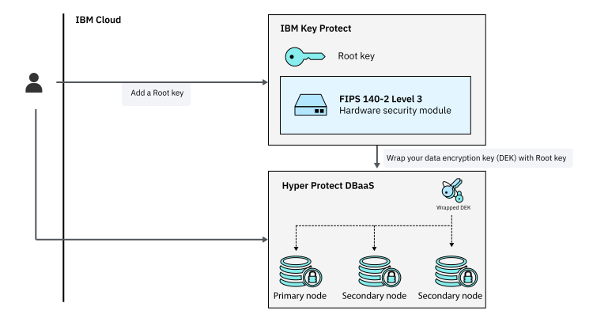

---

copyright:
  years: 2019, 2020
lastupdated: "2020-10-14"

keywords: key protect integration, data encryption, byok

subcollection: hyper-protect-dbaas-for-postgresql

---

{:shortdesc: .shortdesc}
{:codeblock: .codeblock}
{:important: .important}
{:screen: .screen}
{:codeblock: .codeblock}
{:tip: .tip}
{:pre: .pre}
{:note: .note}
{:term: .term}
{:external: target="_blank" .external}

# {{site.data.keyword.keymanagementserviceshort}} integration
{: #key-protect-byok}

The data that you store in {{site.data.keyword.cloud}} {{site.data.keyword.ihsdbaas_postgresql_full}} databases is encrypted by default by randomly generated keys. If you need full control over your encryption keys, you can use [{{site.data.keyword.keymanagementservicelong_notm}}](/docs/key-protect?topic=key-protect-about) to create, add, and manage encryption keys and associate the keys with your {{site.data.keyword.ihsdbaas_postgresql_full}} service instance to encrypt your databases.
{: shortdesc}

The following diagram shows how {{site.data.keyword.ihsdbaas_postgresql_full}} integrates with {{site.data.keyword.hscrypto}}.

{: caption="Integration with {{site.data.keyword.keymanagementserviceshort}}" caption-side="bottom"}

## Step 1. Create or add a root key in {{site.data.keyword.keymanagementserviceshort}}
{: #kp-create-add-key}

To create or add a [root key](#x6946961){: term} in {{site.data.keyword.keymanagementserviceshort}}, complete the following steps:

1. [Provision a {{site.data.keyword.keymanagementserviceshort}} service instance](/docs/key-protect?topic=key-protect-provision) if you don't have one.

2. Go to your instance of {{site.data.keyword.keymanagementserviceshort}} and [create a root key](/docs/key-protect?topic=key-protect-create-root-keys) or [import an existing root key](/docs/key-protect?topic=key-protect-getting-started-tutorial#import-keys).

## Step 2. Grant service authorization
{: #kp-grant-authorization}

Authorize {{site.data.keyword.keymanagementserviceshort}} for use with {{site.data.keyword.ihsdbaas_postgresql_full}} service instances:

1. Open your {{site.data.keyword.cloud_notm}} dashboard.
2. From the menu bar, click **Manage** > **Access (IAM)**.
3. In the side navigation, click **Authorizations**.
4. Click **Create**.
5. In the **Source service** menu, select **{{site.data.keyword.ihsdbaas_postgresql_full}}**.
6. In the **Source service instance** menu, select **All service instances**.
7. In the **Target service** menu, select **{{site.data.keyword.keymanagementserviceshort}}**.
8. In the **Target service instance** menu, select the service instance to authorize.
9. Enable the **Reader** role.
10. Click **Authorize**.

If you want to remove an authorization, see [Removing access](/docs/account?topic=account-assign-access-resources#removing_access).

## Step 3. Create a {{site.data.keyword.ihsdbaas_postgresql_full}} instance with the {{site.data.keyword.keymanagementserviceshort}} Key
{: #use-key-protect}

When you [create a {{site.data.keyword.ihsdbaas_postgresql_full}} service instance](/docs/hyper-protect-dbaas-for-postgresql?topic=hyper-protect-dbaas-for-postgresql-gettingstarted#creating-a-database-cluster-introduction), select your {{site.data.keyword.keymanagementserviceshort}} instance and root key.

The new {{site.data.keyword.ihsdbaas_postgresql_full}} service instance uses your {{site.data.keyword.keymanagementserviceshort}} root key to encrypt your data. To check and manage your root key, click the {{site.data.keyword.keymanagementserviceshort}} service instance on the **Overview** page in your {{site.data.keyword.ihsdbaas_postgresql_full}} service dashboard. You can also see the key status on the [**Nodes** page](/docs/hyper-protect-dbaas-for-postgresql?topic=hyper-protect-dbaas-for-postgresql-nodes).

You can select the {{site.data.keyword.keymanagementserviceshort}} key only when you create the DBaaS instance. Otherwise, a randomly generated key is used by default.
{: note}

## Step 4 (Optional). Remove keys and delete your data
{: #kp-remove-key}

If you delete the key that is used to encrypt your service, you lose access to the data. You can't recover the data from the instance (see [Deleting keys](/docs/key-protect?topic=key-protect-delete-keys)). You might be able to recover your data by restoring a backup into a new service instance.
{: important}

If you want to securely delete your data, you must delete both the service instance and the {{site.data.keyword.keymanagementserviceshort}} key.
