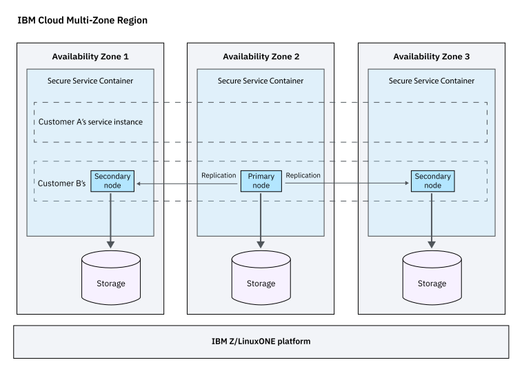

---

copyright:
  years: 2019, 2020
lastupdated: "2020-04-10"

keywords: Hyper Protect DBaaS, database, data security

subcollection: hyper-protect-dbaas-for-postgresql

---

{:shortdesc: .shortdesc}
{:codeblock: .codeblock}
{:important: .important}
{:screen: .screen}
{:codeblock: .codeblock}
{:tip: .tip}
{:pre: .pre}
{:note: .note}
{:external: target="_blank" .external}

# About {{site.data.keyword.cloud_notm}} {{site.data.keyword.ihsdbaas_full}}
{: #overview}

Moving confidential and mission critical data to the cloud presents data confidentiality, security, and reliability concerns. {{site.data.keyword.cloud}} {{site.data.keyword.ihsdbaas_full}} offers highly secure database environments for enterprise workloads with sensitive data.
{: shortdesc}

## Why {{site.data.keyword.cloud_notm}} {{site.data.keyword.ihsdbaas_full}}?
{: #why_hpdb}

Built on {{site.data.keyword.IBM_notm}} LinuxONE technology, {{site.data.keyword.cloud_notm}} {{site.data.keyword.ihsdbaas_full}} provides built-in encryption and tamper protection for data at rest and in flight with <!--excellent vertical scalability-->high availability and performance. With {{site.data.keyword.ihsdbaas_full}}, you can deploy your workloads with sensitive data in a highly secure and easy-to-use enterprise cloud database environment. It ensures complete data confidentiality and grants data owners complete control over the data, protecting data from both external and internal threats.

## How does {{site.data.keyword.cloud_notm}} {{site.data.keyword.ihsdbaas_full}} work?
{: #how_hpdb_works}

The following architectural diagram shows the architecture of {{site.data.keyword.ihsdbaas_full}} in an {{site.data.keyword.cloud_notm}} region. 

{: caption="Figure 1. {{site.data.keyword.ihsdbaas_full}} architecture" caption-side="bottom"}

## Features
{: #features}

### Data security and confidentiality
{: #data_security}

Leveraging {{site.data.keyword.IBM_notm}} LinuxONE pervasive encryption and {{site.data.keyword.IBM_notm}} [Secure Service Container](https://www.ibm.com/us-en/marketplace/secure-service-container){: external} technology, {{site.data.keyword.ihsdbaas_full}} provides workload isolation, restricted administrator access and tamper protection for data at rest and in flight. You can maintain complete control over your data; not even the cloud administrator has access to it at any point. For more information about security, see [Securing your data in {{site.data.keyword.ihsdbaas_postgresql_full}}](/docs/hyper-protect-dbaas-for-postgresql?topic=hyper-protect-dbaas-for-postgresql-mng-data).

### Highly available
{: #highly_available}

When you create a {{site.data.keyword.ihsdbaas_full}} service instance, you create a cluster that consists of one primary node and two secondary nodes (replicas that back up the primary). Each of them is installed in a unique Availability Zone with automatic daily backups in the local storage.

### Fully managed
{: #fully_managed}

{{site.data.keyword.ihsdbaas_full}} offers non-disruptive version upgrades, monitoring of the system by IBM SREs, and around-the-clock support from {{site.data.keyword.cloud_notm}}. You can focus on building applications rather than managing availability, backups, logging, monitoring, scaling, hardware setup, and software patching.

### Developer friendly
{: #developer_friendly}

{{site.data.keyword.ihsdbaas_full}} provides standardized APIs to provision and monitor databases. It‘s easy for you to get started without the need for specialized database skills.
