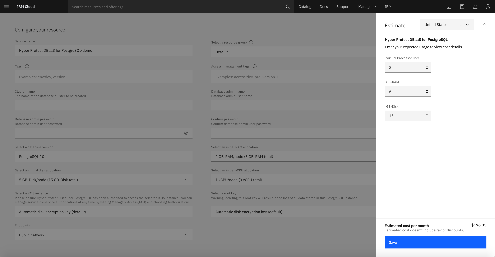

---

copyright:
  years: 2021, 2021
lastupdated: "2021-04-13"

keywords: dbaas pricing

subcollection: hyper-protect-dbaas-for-postgresql

---

{:DomainName: data-hd-keyref="APPDomain"}
{:DomainName: data-hd-keyref="DomainName"}
{:android: data-hd-operatingsystem="android"}
{:api: .ph data-hd-interface='api'}
{:apikey: data-credential-placeholder='apikey'}
{:app_key: data-hd-keyref="app_key"}
{:app_name: data-hd-keyref="app_name"}
{:app_secret: data-hd-keyref="app_secret"}
{:app_url: data-hd-keyref="app_url"}
{:authenticated-content: .authenticated-content}
{:beta: .beta}
{:c#: data-hd-programlang="c#"}
{:cli: .ph data-hd-interface='cli'}
{:codeblock: .codeblock}
{:curl: .ph data-hd-programlang='curl'}
{:deprecated: .deprecated}
{:dotnet-standard: .ph data-hd-programlang='dotnet-standard'}
{:download: .download}
{:external: target="_blank" .external}
{:faq: data-hd-content-type='faq'}
{:fuzzybunny: .ph data-hd-programlang='fuzzybunny'}
{:generic: data-hd-operatingsystem="generic"}
{:generic: data-hd-programlang="generic"}
{:gif: data-image-type='gif'}
{:go: .ph data-hd-programlang='go'}
{:help: data-hd-content-type='help'}
{:hide-dashboard: .hide-dashboard}
{:hide-in-docs: .hide-in-docs}
{:important: .important}
{:ios: data-hd-operatingsystem="ios"}
{:java: .ph data-hd-programlang='java'}
{:java: data-hd-programlang="java"}
{:javascript: .ph data-hd-programlang='javascript'}
{:javascript: data-hd-programlang="javascript"}
{:new_window: target="_blank"}
{:note .note}
{:note: .note}
{:objectc data-hd-programlang="objectc"}
{:org_name: data-hd-keyref="org_name"}
{:php: data-hd-programlang="php"}
{:pre: .pre}
{:preview: .preview}
{:python: .ph data-hd-programlang='python'}
{:python: data-hd-programlang="python"}
{:route: data-hd-keyref="route"}
{:row-headers: .row-headers}
{:ruby: .ph data-hd-programlang='ruby'}
{:ruby: data-hd-programlang="ruby"}
{:runtime: architecture="runtime"}
{:runtimeIcon: .runtimeIcon}
{:runtimeIconList: .runtimeIconList}
{:runtimeLink: .runtimeLink}
{:runtimeTitle: .runtimeTitle}
{:screen: .screen}
{:script: data-hd-video='script'}
{:service: architecture="service"}
{:service_instance_name: data-hd-keyref="service_instance_name"}
{:service_name: data-hd-keyref="service_name"}
{:shortdesc: .shortdesc}
{:space_name: data-hd-keyref="space_name"}
{:step: data-tutorial-type='step'}
{:subsection: outputclass="subsection"}
{:support: data-reuse='support'}
{:swift: .ph data-hd-programlang='swift'}
{:swift: data-hd-programlang="swift"}
{:table: .aria-labeledby="caption"}
{:term: .term}
{:tip: .tip}
{:tooling-url: data-tooling-url-placeholder='tooling-url'}
{:troubleshoot: data-hd-content-type='troubleshoot'}
{:tsCauses: .tsCauses}
{:tsResolve: .tsResolve}
{:tsSymptoms: .tsSymptoms}
{:tutorial: data-hd-content-type='tutorial'}
{:ui: .ph data-hd-interface='ui'}
{:unity: .ph data-hd-programlang='unity'}
{:url: data-credential-placeholder='url'}
{:user_ID: data-hd-keyref="user_ID"}
{:vbnet: .ph data-hd-programlang='vb.net'}
{:video: .video}

# Pricing
{: #pricing}

{{site.data.keyword.cloud}} {{site.data.keyword.ihsdbaas_postgresql_full}} is priced based on the total amount of RAM, disk, and number of vCPUs allocated to your service instance, prorated hourly. The cost includes daily backups and there're no additional charges for ingress, egress, or IOPS. For more information about RAM, disk, and vCPUs, see [Resource breakdown](/docs/hyper-protect-dbaas-for-postgresql?topic=hyper-protect-dbaas-for-postgresql-resources-scaling#resources-breakdown).
{: shortdesc} 

## Estimating costs
{: #estimate-costs}

You can find the pricing plans for {{site.data.keyword.ihsdbaas_postgresql_full}} on the [service creation page](https://cloud.ibm.com/catalog/services/hyper-protect-dbaas-for-postgresql){: external}.

A 30-day free plan is available for evaluation purposes. For the flexible plan, billing is based on the total amount of resources that are allocated to your service instance. The total resource allocation is three times the amount you select for each node because one {{site.data.keyword.ihsdbaas_postgresql_full}} service instance has three nodes in a cluster for high availability. The following is a pricing example.

Resource | Price (per month)
----------|-----------
RAM - 2 GB/node | $7.5 USD/GB x 2 GB/node x 3 nodes = $45 USD
Disk - 5 GB/node | $0.89 USD/GB x 5 GB/node x 3 nodes = $13.35 USD
vCPU - 1 vCPU/node | $46 USD/vCPU x 1 vCPU/node x 3 nodes = $138 USD
Total | $45 + $13.35 + $138 = $196.35 USD
{: caption="Table 1. Pricing example" caption-side="top"}

You can use the cost estimator on the service creation page to estimate your costs. Click **Add to estimate** or **Estimate costs** and input your total allocation values (three times the values per node). Click **Calculate cost**. The estimated cost doesn’t include tax or discounts.

{: caption="Figure 1. Using the cost estimator" caption-side="bottom"}

## Scaling resources
{: #scale-resources}

You can manually scale the amount of RAM, disk, and number of vCPUs allocated to your {{site.data.keyword.ihsdbaas_postgresql_full}} service instance to suit your workload and the size of your data. For more information and detailed instructions, see [Scaling RAM, disk, and vCPU](/docs/hyper-protect-dbaas-for-postgresql?topic=hyper-protect-dbaas-for-postgresql-resources-scaling).

You can see the estimated cost in the UI when you select new resource values. The new billing takes effect when all three nodes are scaled.

## Viewing usage
{: #view-usage}

Go to **Manage > Billing and usage** in the {{site.data.keyword.cloud_notm}} console. For more information, see [Viewing your usage](/docs/billing-usage?topic=billing-usage-viewingusage).
